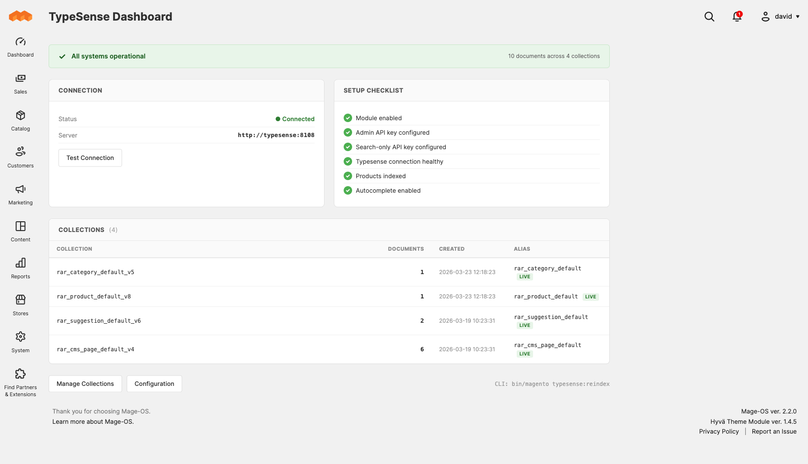
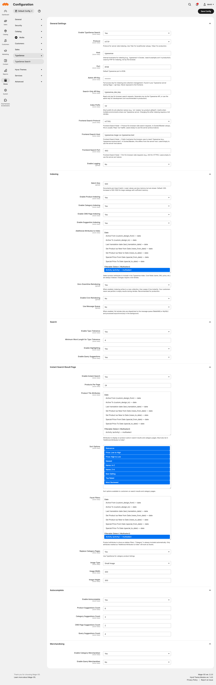
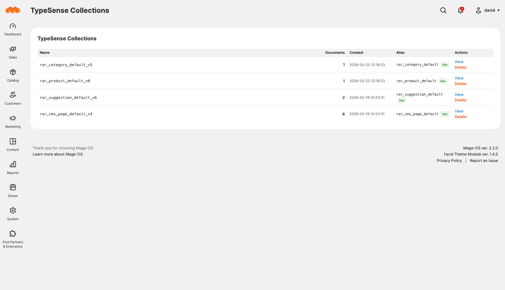
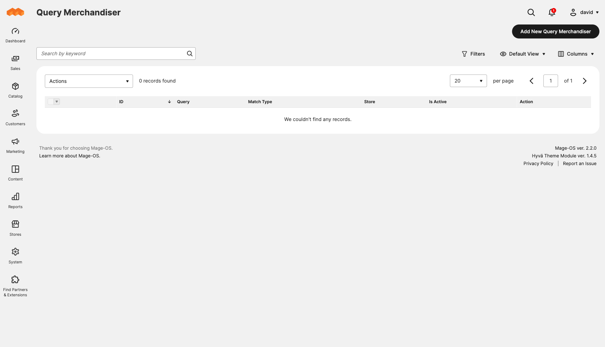
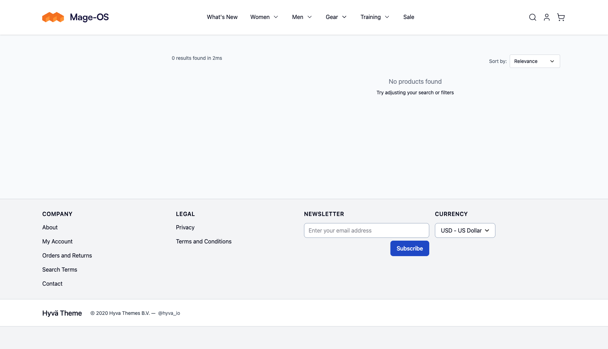
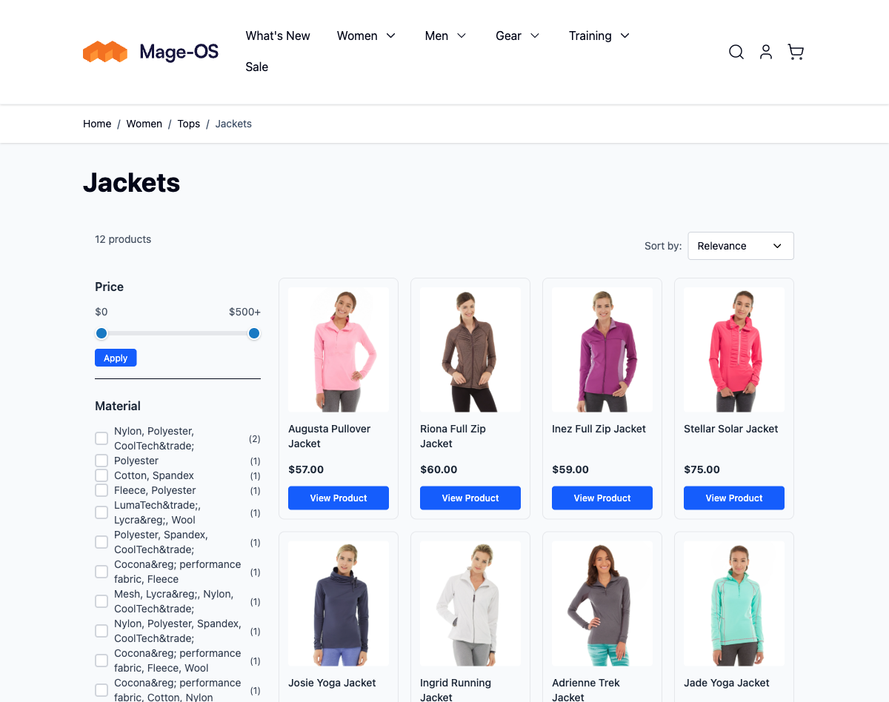

# RunAsRoot Magento 2 TypeSense

[](https://github.com/run-as-root/Typesense-Magento-2/actions/workflows/ci.yml)


Open-source [Typesense](https://typesense.org) search integration for Magento 2 / Mage-OS with visual merchandising, zero-downtime reindexing, and Hyva-native frontend components.

---

## Screenshots

### Admin Dashboard


### Admin Configuration


### Collection Browser


### Query Merchandiser


### Frontend — Instant Search


### Frontend — Category Page


---

## Features

- Full-text search powered by Typesense with typo tolerance and instant results
- Zero-downtime reindexing using collection versioning and atomic alias swaps
- Multi-entity indexing: products, categories, CMS pages, and search suggestions
- Hyva-compatible autocomplete (CSP-safe Alpine.js) with multi-index results
- Instant search page replacing the default Magento catalog search
- Category page powered by Typesense with client-side filtering and sorting
- Visual category merchandiser on the category edit page (Algolia-style sortable product table)
- Admin query merchandiser for keyword-level product promotion/demotion
- Admin synonym manager and collection browser
- CLI commands for reindexing, collection management, and health checks
- Cron-based and message-queue-based background reindexing
- CSP whitelist for Typesense API endpoints
- Configurable per store view

---

## Requirements

| Dependency | Version |
|---|---|
| PHP | 8.3+ |
| Magento 2 / Mage-OS | 2.4.7+ |
| Typesense | 27+ |
| Hyva Theme | 1.3+ |
| typesense/typesense-php | ^4.9 |

---

## Installation

```bash
composer require run-as-root/magento2-typesense
bin/magento setup:upgrade
bin/magento setup:di:compile
```

For production:

```bash
bin/magento setup:static-content:deploy
bin/magento cache:flush
```

---

## Configuration

Navigate to **Stores > Configuration > TypeSense > TypeSense Search**.

### General Settings

| Setting | Default | Description |
|---|---|---|
| Enable TypeSense Search | No | Master switch for the module |
| Protocol | http | `http` or `https` for server-side (PHP) requests |
| Host | localhost | Internal hostname for indexing (e.g., `typesense` in Docker) |
| Port | 8108 | Typesense server port |
| Admin API Key | — | Server-side admin key (never exposed to frontend) |
| Search-Only API Key | — | Public key used for frontend search requests |
| Frontend Search Protocol | — | Override protocol for browser-side requests (useful in Warden/Docker setups) |
| Frontend Search Host | — | Public hostname the browser uses to reach Typesense |
| Frontend Search Port | — | Override port for browser-side requests |
| Index Prefix | rar | Prefix for all collection names |
| Enable Logging | No | Logs search queries and indexing activity |

### Indexing Settings

| Setting | Default | Description |
|---|---|---|
| Batch Size | 200 | Documents per import batch |
| Index Products | Yes | Enable product indexing |
| Index Categories | Yes | Enable category indexing |
| Index CMS Pages | Yes | Enable CMS page indexing |
| Index Suggestions | Yes | Enable search suggestion indexing |
| Additional Attributes to Index | — | Extra product attributes to include in the Typesense index (see below) |
| Zero-Downtime Reindex | Yes | Use alias swap strategy for live reindexing |
| Enable Cron Reindex | No | Schedule automatic reindexing |
| Cron Schedule | `0 2 * * *` | Cron expression for scheduled reindex |
| Enable Queue Reindex | No | Use message queue for async reindexing |

### Instant Search Settings

| Setting | Default | Description |
|---|---|---|
| Enable Instant Search | Yes | Replace the Magento search results page |
| Products Per Page | 20 | Results per page on the search results page |
| Product Tile Attributes | — | Attributes displayed on product cards (must also be indexed) |
| Sort Options | — | Sort options available to customers (see below) |
| Replace Category Pages | No | Use Typesense for category product listings |
| Image Type | — | Product image type to use on tiles |
| Image Width / Height | — | Dimensions for product tile images |

### Autocomplete Settings

| Setting | Default | Description |
|---|---|---|
| Enable Autocomplete | Yes | Show autocomplete dropdown on search input |
| Product Count | 6 | Max product results in autocomplete |
| Category Count | 3 | Max category results |
| CMS Page Count | 2 | Max CMS page results |
| Suggestion Count | 4 | Max query suggestion results |

---

## Configurable Attributes

### Additional Attributes to Index

Navigate to **Stores > Configuration > TypeSense > TypeSense Search > Indexing > Additional Attributes to Index**.

Select any product attributes you want included in the Typesense product documents. Core fields (name, SKU, price, description, URL, images, categories) are always indexed. Use this to add attributes like `color`, `size`, `brand`, `material`, or any custom attribute.

Attributes are grouped by input type (select/multiselect, boolean, numeric, text) so you can quickly identify which ones make sense to index or use as facets. Each entry shows the attribute label, code, and input type — for example: `Color (color) — select`.

Changes to this setting require a full product reindex to take effect.

### Product Tile Attributes

Navigate to **Stores > Configuration > TypeSense > TypeSense Search > Instant Search > Product Tile Attributes**.

Select which attributes from your indexed set should be visible on product cards in search results and category pages. An attribute must appear in "Additional Attributes to Index" before it can be displayed on tiles.

### Sort Options

Navigate to **Stores > Configuration > TypeSense > TypeSense Search > Instant Search > Sort Options**.

Choose which sort options are available to customers on search results and category pages. Available options:

| Option | Description |
|---|---|
| Relevance | Default Typesense relevance ranking |
| Price: Low to High | Ascending price |
| Price: High to Low | Descending price |
| Newest | Most recently created products |
| Name: A–Z | Alphabetical ascending |
| Name: Z–A | Alphabetical descending |
| Best Selling | Based on sales order data |
| Top Rated | Based on review ratings |
| Most Reviewed | Based on review count |

---

## CLI Commands

| Command | Description |
|---|---|
| `bin/magento typesense:reindex [--entity=TYPE]` | Reindex all or a specific entity type into Typesense. Valid types: `product`, `category`, `cms_page`, `suggestion` |
| `bin/magento typesense:collection:list` | List all Typesense collections with document count and alias mappings |
| `bin/magento typesense:collection:delete <name>` | Delete a named Typesense collection |
| `bin/magento typesense:health` | Check the health status of the Typesense server |

### Examples

```bash
# Full reindex of all entity types
bin/magento typesense:reindex

# Reindex only products
bin/magento typesense:reindex --entity=product

# List collections to inspect index state and verify alias assignments
bin/magento typesense:collection:list

# Check server connectivity before indexing
bin/magento typesense:health
```

---

## Indexing

### How It Works

The indexer pipeline is split into three layers:

1. **EntityIndexer** — per entity type; fetches records and builds document arrays
2. **IndexerOrchestrator** — coordinates collection creation, batched import, and alias management
3. **BatchImportService** — chunks documents and sends them to Typesense's bulk import API

### Entity Types

| Entity | Collection Pattern | Magento Indexer ID |
|---|---|---|
| Products | `<prefix>_product_v<n>` | `run_as_root_typesense_product` |
| Categories | `<prefix>_category_v<n>` | `run_as_root_typesense_category` |
| CMS Pages | `<prefix>_cms_page_v<n>` | `run_as_root_typesense_cms_page` |
| Suggestions | `<prefix>_suggestion_v<n>` | `run_as_root_typesense_suggestion` |

Collections are suffixed with a version number (e.g., `rar_product_v2`) so that the live collection pointed to by the alias is never written to during a reindex.

### Zero-Downtime Reindexing

When zero-downtime reindexing is enabled:

1. `ZeroDowntimeService::startReindex()` creates a new versioned collection (e.g., `rar_product_v2` while `rar_product` alias points at `rar_product_v1`)
2. All documents are indexed into the new versioned collection
3. `ZeroDowntimeService::finishReindex()` atomically swaps the alias to point at the new collection and deletes the old one

This means the live alias (`rar_product`) always points at a fully populated collection.

### Magento Indexer Integration

The module registers standard Magento indexers and supports incremental updates via MView (MySQL change log). After configuration changes or new product saves, the relevant indexer is flagged and can be reindexed via the standard `bin/magento indexer:reindex` command.

---

## Merchandising

All merchandising is powered by [Typesense Curation](https://typesense.org/docs/guide/curations.html) override rules synced from the Magento admin.

### Visual Category Merchandiser

The category merchandiser is embedded directly on the **Catalog > Categories** edit page — no separate admin screen needed.

On any category's edit page, scroll to the **TypeSense Merchandising** section to find an Algolia-style sortable product table. You can:

- Drag and drop products to pin them to specific positions
- Promote products to the top of the category listing
- Demote or hide specific products

Changes are saved alongside the category and sync to Typesense curation rules on save.

### Query Merchandiser

Navigate to **Content > TypeSense > Query Merchandiser**.

Promote or bury products for specific search queries. Each rule targets a keyword and specifies pinned (top positions) or hidden product IDs.

---

## Frontend

All frontend components require the Hyva theme. They use Alpine.js for reactivity and make direct Typesense API calls using the public search-only API key. All components are written to be CSP-compatible — no inline `eval()` or dynamic script injection.

### Autocomplete

Injected into the Hyva search form. Opens a dropdown with results from all configured entity collections. Configured via the autocomplete settings in admin.

### Instant Search Page

Replaces the Magento search results page (`/catalogsearch/result`). Renders a full search results page with facets, pagination, and sorting powered by Typesense. The default Magento search result blocks are removed from the layout to prevent duplicate results.

### Category Page

When enabled, replaces the Magento category product listing with a Typesense-powered equivalent. Filtering, sorting, and pagination all happen client-side against Typesense.

---

## Extending

### Adding a Custom Entity Indexer

1. Implement `RunAsRoot\TypeSense\Api\EntityIndexerInterface`:

```php
<?php

declare(strict_types=1);

namespace Vendor\Module\Model\Indexer;

use RunAsRoot\TypeSense\Api\EntityIndexerInterface;

class BlogPostEntityIndexer implements EntityIndexerInterface
{
    public function getEntityType(): string
    {
        return 'blog_post';
    }

    public function getIndexerCode(): string
    {
        return 'vendor_module_blog_post';
    }

    public function getSchemaFields(): array
    {
        return [
            ['name' => 'id', 'type' => 'string'],
            ['name' => 'title', 'type' => 'string'],
            ['name' => 'content', 'type' => 'string'],
        ];
    }

    public function buildDocuments(array $entityIds, int $storeId): iterable
    {
        // Fetch and yield document arrays
        yield ['id' => '1', 'title' => 'Hello World', 'content' => '...'];
    }
}
```

2. Register in your module's `etc/di.xml`:

```xml
<type name="RunAsRoot\TypeSense\Model\Indexer\EntityIndexerPool">
    <arguments>
        <argument name="indexers" xsi:type="array">
            <item name="blog_post" xsi:type="object">Vendor\Module\Model\Indexer\BlogPostEntityIndexer</item>
        </argument>
    </arguments>
</type>
```

3. Run `bin/magento setup:di:compile`.

Your entity type is now available to `typesense:reindex --entity=blog_post` and to the orchestrator for full and partial reindexing.

---

## Development

### Setup

```bash
# Clone the repository
git clone git@github.com:run-as-root/Typesense-Magento-2.git

# Install dependencies
composer install

# Run static analysis
vendor/bin/phpstan analyse

# Run unit tests
vendor/bin/phpunit --testsuite Unit

# Run integration tests (requires running Typesense + Magento)
vendor/bin/phpunit --testsuite Integration --group integration
```

### Architecture Overview

```
├── Api/                        Interfaces (EntityIndexerInterface, etc.)
├── Block/                      Admin blocks
├── Console/Command/            CLI commands (reindex, collection:list, etc.)
├── Controller/                 Admin AJAX controllers
├── Cron/                       Scheduled reindexing job
├── Model/
│   ├── Client/                 TypeSenseClientFactory (wraps typesense-php)
│   ├── Collection/             CollectionManager, AliasManager, ZeroDowntimeService
│   ├── Config/                 TypeSenseConfig, source models
│   ├── Curation/               Sync services for merchandising rules
│   ├── Indexer/                Entity indexers and orchestrator
│   └── Merchandising/          ORM models and repositories
├── Observer/                   Layout load observer for CSP / frontend injection
├── Plugin/                     CSP dynamic collector
├── Queue/Consumer/             Message queue consumer for async reindexing
├── Test/
│   ├── Unit/                   PHPUnit unit tests
│   └── Integration/            Integration test stubs (@group integration)
├── Ui/                         Magento UI component data providers
├── view/adminhtml/             Admin layout, templates, JS
├── view/frontend/              Hyva layout, Alpine.js components
└── ViewModel/                  View models for admin and frontend templates
```

### Code Standards

- PHP 8.3+ features (readonly properties, enums, fibers where appropriate)
- Final classes throughout — prefer composition over inheritance
- `declare(strict_types=1)` in every file
- snake_case test method names
- All public methods covered by unit tests
- PHPStan level 6

---

## Contributing

1. Fork the repository
2. Create a feature branch: `git checkout -b feature/my-feature`
3. Write tests first (TDD)
4. Implement the feature
5. Ensure all tests pass: `vendor/bin/phpunit --testsuite Unit`
6. Run static analysis: `vendor/bin/phpstan analyse`
7. Submit a pull request against `main`

Please keep pull requests focused. One feature or fix per PR.

---

## License

MIT — see [LICENSE](LICENSE) for full text.
